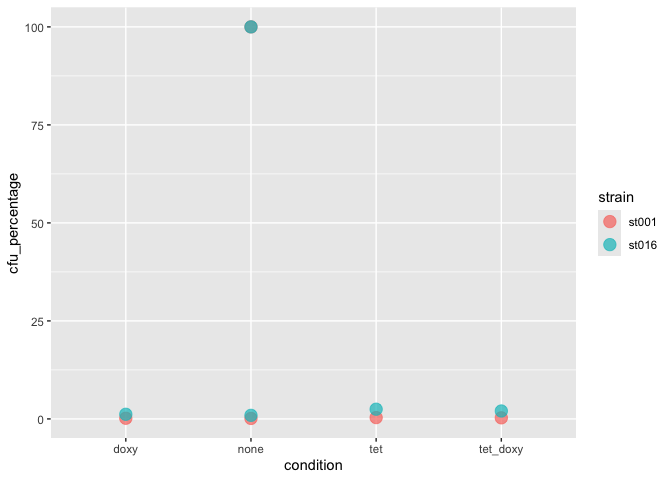
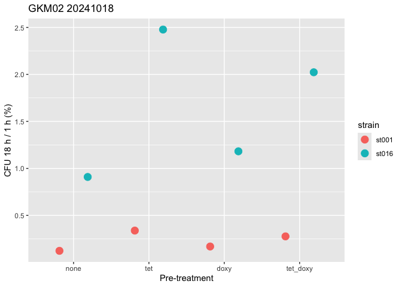

CFU analysis template
================
Georgia
2024-10-25

# Script to analyse and plot cfu count

This script reads a CSV file with CFU counts, processes them through
finding the average CFU count across spots, corrects for dilution
factor, normalises to the immediately post-infection time-point and
plots the data.

This script reads CSV files with the following columns:

- date (of counting final plate)
- number (ID so each condition and timepoint has a separate ID for
  validation)
- spot_number (usually 1-3)
- strain (salmonella),
- infection_time (post-infection)
- condition (pre-infection treatment)
- antibiotic (post-infection antibiotic used)
- dilution (factor that cfu was counted at e.g. 4 = 10^-4)
- cfu_count (per spot)

For a new CFU experiment, copy the template section into a new script
and replace:

- GKMXX
- Date (in plot title)

You could then copy it back as a new section as all data frames are
saved with an experiment identifier (GKMXX) so can be analysed and
plotted in parallel if needed.

If needed, also change:

- Strain numbers (e.g. ST001)
- Condition order (keep in mind this is saved under the same variable
  “order” for all experiments)

Remember to change your working directory and file paths.

``` r
library(dplyr)
```

    ## 
    ## Attaching package: 'dplyr'

    ## The following objects are masked from 'package:stats':
    ## 
    ##     filter, lag

    ## The following objects are masked from 'package:base':
    ## 
    ##     intersect, setdiff, setequal, union

``` r
library(ggplot2)

#setwd("/PATH/TO/YOUR/DIRECTORY/")    # not needed here as the data file is in the same repo
```

# Example data processing

## Load and process data

``` r
# read in file
GKM02_data <- read.csv("cfu_analysis_example_data.csv")

# view dataframe
head(GKM02_data)
```

    ##       date number spot_number strain infection_time condition antibiotic
    ## 1 20241018      1           1  st001              1      none        cef
    ## 2 20241018      1           2  st001              1      none        cef
    ## 3 20241018      1           3  st001              1      none        cef
    ## 4 20241018      2           1  st016              1      none        cef
    ## 5 20241018      2           2  st016              1      none        cef
    ## 6 20241018      2           3  st016              1      none        cef
    ##   dilution cfu_count
    ## 1        4        25
    ## 2        4        19
    ## 3        4        21
    ## 4        4        17
    ## 5        4        15
    ## 6        4        12

``` r
# process data
GKM02_data <- GKM02_data %>% 
  # find average cfu across the three spots, grouped by all other factors so appear in new tibble
  group_by(number, strain, infection_time, condition, antibiotic, dilution) %>% 
  summarise(cfu_count = mean(cfu_count)) %>% 
  # find number of bacteria per ml, took 20 ul (*50)
  mutate(cfu_per_ml = cfu_count * 50) %>% 
  # correct for dilution by * 10^dilution factor
  mutate(cfu_corrected = cfu_per_ml * 10^dilution )
```

    ## `summarise()` has grouped output by 'number', 'strain', 'infection_time',
    ## 'condition', 'antibiotic'. You can override using the `.groups` argument.

``` r
# view dataframe
head(GKM02_data)
```

    ## # A tibble: 6 × 9
    ## # Groups:   number, strain, infection_time, condition, antibiotic [6]
    ##   number strain infection_time condition antibiotic dilution cfu_count
    ##    <int> <chr>           <int> <chr>     <chr>         <int>     <dbl>
    ## 1      1 st001               1 none      cef               4     21.7 
    ## 2      2 st016               1 none      cef               4     14.7 
    ## 3      3 st001              18 none      cef               2      2.67
    ## 4      4 st001              18 tet       cef               2      7.33
    ## 5      5 st001              18 doxy      cef               2      3.67
    ## 6      6 st001              18 tet_doxy  cef               2      6   
    ## # ℹ 2 more variables: cfu_per_ml <dbl>, cfu_corrected <dbl>

## Normalise

Here the later timepoint (here, 18 h) is normalised against the
immediately post-infection timepoint (here, 1 h).

``` r
# extract 1 h baseline for ST001
GKM02_baseline_st001 <-
  GKM02_data %>% 
  filter(infection_time == "1", strain == "st001") %>% 
  pull(cfu_corrected)

# view baseline
GKM02_baseline_st001
```

    ## [1] 10833333

``` r
# normalise 18 h against this 1 h baseline ST001
GKM02_st001 <-
  GKM02_data %>% 
  filter(strain == "st001") %>% 
  mutate(cfu_norm = cfu_corrected / GKM02_baseline_st001)

# view new column
GKM02_st001 %>% 
  ungroup() %>% 
  select(number, strain, infection_time, condition, cfu_count, cfu_corrected, cfu_norm) %>% 
  head()
```

    ## # A tibble: 5 × 7
    ##   number strain infection_time condition cfu_count cfu_corrected cfu_norm
    ##    <int> <chr>           <int> <chr>         <dbl>         <dbl>    <dbl>
    ## 1      1 st001               1 none          21.7      10833333.  1      
    ## 2      3 st001              18 none           2.67        13333.  0.00123
    ## 3      4 st001              18 tet            7.33        36667.  0.00338
    ## 4      5 st001              18 doxy           3.67        18333.  0.00169
    ## 5      6 st001              18 tet_doxy       6           30000   0.00277

``` r
# extract 1 h baseline for ST016
GKM02_baseline_st016 <-
  GKM02_data %>% 
  filter(infection_time == "1", strain == "st016") %>% 
  pull(cfu_corrected)

# view baseline
GKM02_baseline_st016
```

    ## [1] 7333333

``` r
# normalise 18 h against this 1 h baseline ST016
GKM02_st016 <-
  GKM02_data %>% 
  filter(strain == "st016") %>% 
  mutate(cfu_norm = cfu_corrected / GKM02_baseline_st016)

# view new column
GKM02_st016 %>% 
  ungroup() %>% 
  select(number, strain, infection_time, condition, cfu_count, cfu_corrected, cfu_norm) %>% 
  head()
```

    ## # A tibble: 5 × 7
    ##   number strain infection_time condition cfu_count cfu_corrected cfu_norm
    ##    <int> <chr>           <int> <chr>         <dbl>         <dbl>    <dbl>
    ## 1      2 st016               1 none           14.7      7333333.  1      
    ## 2      7 st016              18 none           13.3        66667.  0.00909
    ## 3      8 st016              18 tet            36.3       181667.  0.0248 
    ## 4      9 st016              18 doxy           17.3        86667.  0.0118 
    ## 5     10 st016              18 tet_doxy       29.7       148333.  0.0202

``` r
# merge data from both strains
GKM02_data_full <-   
  full_join(GKM02_st001, GKM02_st016) %>% 
  # make cfu_norm into percentage
  mutate(cfu_percentage = cfu_norm * 100)
```

    ## Joining with `by = join_by(number, strain, infection_time, condition,
    ## antibiotic, dilution, cfu_count, cfu_per_ml, cfu_corrected, cfu_norm)`

``` r
# view new merged dataframe
GKM02_data_full %>% 
  ungroup() %>% 
  select(number, strain, infection_time, condition, cfu_count, cfu_corrected, cfu_norm) %>% 
  head(10)
```

    ## # A tibble: 10 × 7
    ##    number strain infection_time condition cfu_count cfu_corrected cfu_norm
    ##     <int> <chr>           <int> <chr>         <dbl>         <dbl>    <dbl>
    ##  1      1 st001               1 none          21.7      10833333.  1      
    ##  2      3 st001              18 none           2.67        13333.  0.00123
    ##  3      4 st001              18 tet            7.33        36667.  0.00338
    ##  4      5 st001              18 doxy           3.67        18333.  0.00169
    ##  5      6 st001              18 tet_doxy       6           30000   0.00277
    ##  6      2 st016               1 none          14.7       7333333.  1      
    ##  7      7 st016              18 none          13.3         66667.  0.00909
    ##  8      8 st016              18 tet           36.3        181667.  0.0248 
    ##  9      9 st016              18 doxy          17.3         86667.  0.0118 
    ## 10     10 st016              18 tet_doxy      29.7        148333.  0.0202

## Plot the data

``` r
# plot initially, check the baseline is at 100% as expected then can filter out
GKM02_data_full %>% 
  ggplot(mapping = aes(x = condition, y = cfu_percentage, colour = strain)) +
  geom_point(size = 4, alpha = 0.7) # transparency so can check both baselines are at 100%
```

<!-- -->

``` r
# set desired order of conditions for plot
order <- c("none", "tet", "doxy", "tet_doxy")

# now plot with more specifications
GKM02_plot <-
  GKM02_data_full %>% 
  filter(infection_time != "1") %>% 
  # reorder columns as specified by order variable (ensure data points also swap, not just the labels)
  mutate(condition = factor(condition, levels = order) ) %>%  
  
  ggplot(mapping = aes(x = condition, y = cfu_percentage, colour = strain)) +
  geom_point(size = 4, position = position_dodge(width = 0.75)) +
  labs(title = "GKM02 20241018", x = "Pre-treatment", y = "CFU 18 h / 1 h (%)")

# visualise plot
GKM02_plot
```

<!-- -->

``` r
# save plot, save in data folder first so do not overwrite previous plots
#ggsave("GKM02_plot.png", plot = GKM02_plot, path = "ENTER/PATH")   # not needed here
```

# TEMPLATE CODE TO COPY —————————————————————-

``` r
library(dplyr)
library(ggplot2)

setwd("/PATH/TO/YOUR/DIRECTORY/")

# Process GKMXX data ------------------------------------------------------
##Load and process data
GKMXX_data <- read.csv("CFU_analysis_GKMXX_data.csv") %>%
  # find average cfu across the three spots, grouped by all other factors so appear in new tibble
  group_by(number, strain, infection_time, condition, antibiotic, dilution) %>% 
  summarise(cfu_count = mean(cfu_count)) %>% 
  # find number of bacteria per ml, took 20 ul (*50)
  mutate(cfu_per_ml = cfu_count * 50) %>% 
  # correct for dilution by * 10^dilution factor
  mutate(cfu_corrected = cfu_per_ml * 10^dilution )


##Normalise 18 h against 1 h
# extract 1 h baseline for ST001
GKMXX_baseline_st001 <-
  GKMXX_data %>% 
  filter(infection_time == "1", strain == "st001") %>% 
  pull(cfu_corrected)

# normalise 18 h against this 1 h baseline ST001
GKMXX_st001 <-
  GKMXX_data %>% 
  filter(strain == "st001") %>% 
  mutate(cfu_norm = cfu_corrected / GKMXX_baseline_st001)


# extract 1 h baseline for ST016
GKMXX_baseline_st016 <-
  GKMXX_data %>% 
  filter(infection_time == "1", strain == "st016") %>% 
  pull(cfu_corrected)

# normalise 18 h against this 1 h baseline ST016
GKMXX_st016 <-
  GKMXX_data %>% 
  filter(strain == "st016") %>% 
  mutate(cfu_norm = cfu_corrected / GKMXX_baseline_st016)


# merge data
GKMXX_data_full <-   
  full_join(GKMXX_st001, GKMXX_st016) %>% 
  # make cfu_norm into percentage
  mutate(cfu_percentage = cfu_norm * 100)


# Plot GKMXX data ---------------------------------------------------------

# plot initially, check the baseline is at 100% as expected then can filter out
GKMXX_data_full %>% 
  ggplot(mapping = aes(x = condition, y = cfu_percentage, colour = strain)) +
  geom_point(size = 4, alpha = 0.7) # transparency so can check both baselines are at 100%

# set desired order of conditions for plot
order <- c("none", "tet", "doxy", "tet_doxy")

# now plot with more specifications
GKMXX_plot <-
  GKMXX_data_full %>% 
  filter(infection_time != "1") %>% 
  # reorder columns as specified by order variable (ensure data points also swap, not just the labels)
  mutate(condition = factor(condition, levels = order) ) %>%  
  
  ggplot(mapping = aes(x = condition, y = cfu_percentage, colour = strain)) +
  geom_point(size = 4, position = position_dodge(width = 0.75)) +
  labs(title = "GKMXX 2024XXXX", x = "Pre-treatment", y = "CFU 18 h / 1 h (%)")
#theme_classic()            # if want classic theme, add + at end of line above and uncomment

# visualise plot
GKMXX_plot

# save plot, do not overwrite previous plots
ggsave("GKMXX_plot.png", plot = GKMXX_plot, path = "ENTER/PATH")
```
