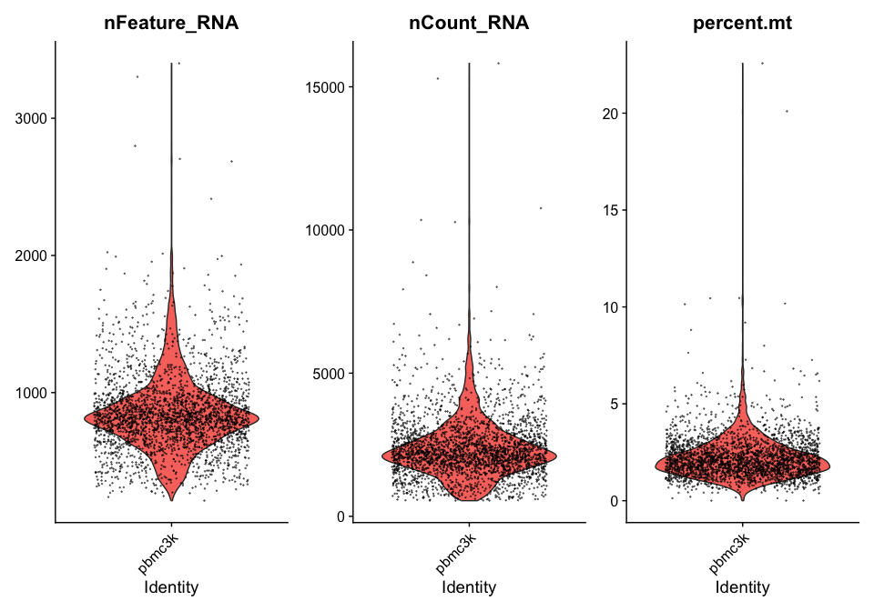
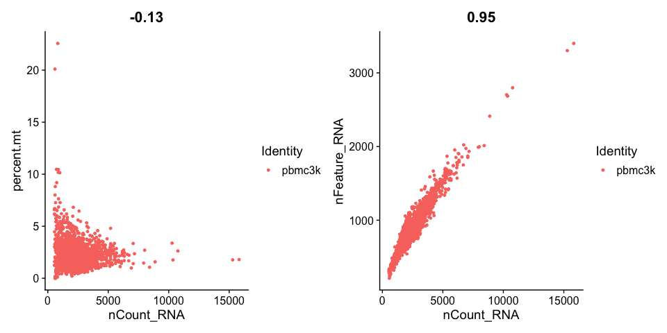
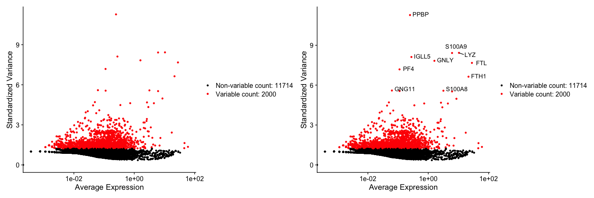

Seurat tutorial
================
Georgia Miller
2024-10-24

## This is following the Seurat tutorial from <https://satijalab.org/seurat/articles/pbmc3k_tutorial>

This is to analyse a dataset of Peripheral Blood Mononuclear Cells
(PBMCs) available from 10X genomics. 2,700 single cells were sequenced
on Illumina NextSeq500.

# Read in data

Read10X reads in output of the cellranger pipeline form 10X, returns
Unique Molecular Identified (UMI) count matrix. Values in matrix
represents number of molecules for each feature (gene, row) detected in
each cell (column). More recent versions use h5 file format, read in
using Read10X_h5() function.

``` r
# Load the PBMC dataset
pbmc.data <- Read10X(data.dir = "/Users/k2477939/Documents/myrepo/seurat_tutorial/filtered_gene_bc_matrices/hg19/")
```

## Set up Seurat object

Use count matrix to create a Seurat object which is a container for both
data (e.g. count matrix) and analysis (PCA, clustering results) for
sc-dataset.

``` r
# Initialise Seurat object with raw non-normalised data. 
pbmc <- CreateSeuratObject(counts = pbmc.data, project = "pbmc3k", min.cells = 3, min.features = 200)
```

    ## Warning: Feature names cannot have underscores ('_'), replacing with dashes
    ## ('-')

``` r
pbmc
```

    ## An object of class Seurat 
    ## 13714 features across 2700 samples within 1 assay 
    ## Active assay: RNA (13714 features, 0 variable features)
    ##  1 layer present: counts

## Examine data

Examine count matrix data. . values are 0s, this sparse-matrix
representation saves memory and speed

``` r
# Examine some genes in the first 30 cells
pbmc.data[c("CD3D", "TCL1A", "MS4A1"), 1:30]
```

    ## 3 x 30 sparse Matrix of class "dgCMatrix"

    ##   [[ suppressing 30 column names 'AAACATACAACCAC-1', 'AAACATTGAGCTAC-1', 'AAACATTGATCAGC-1' ... ]]

    ##                                                                    
    ## CD3D  4 . 10 . . 1 2 3 1 . . 2 7 1 . . 1 3 . 2  3 . . . . . 3 4 1 5
    ## TCL1A . .  . . . . . . 1 . . . . . . . . . . .  . 1 . . . . . . . .
    ## MS4A1 . 6  . . . . . . 1 1 1 . . . . . . . . . 36 1 2 . . 2 . . . .

``` r
# Sparse size
object.size(as.matrix(pbmc.data))
```

    ## 709591472 bytes

``` r
# Dense size
object.size(pbmc.data)
```

    ## 29905192 bytes

# Pre-processing

## QC and selecting cells for further analysis

Common QC metrics include

- No. of unique genes detected in each cell
  - low-quality cells or empty droplets often have very few genes
  - cell doublets or multiplets may have aberrantly high gene count
- total no. molecules detected in a cell
  - correlates strongly with unique genes
- percentage of reads that map to the mitochondrial contamination
  - low-quality/dying cells often have extensive mt contamination
  - calculates percentage of counts originates from a set of features
    with PercentageFeatureSet()
  - set of all genes starting with MT- used as set of mt genes

Find no. unique genes and total molecules in the object metadata as they
are automatically calculated in CreateSeuratObject()

``` r
 # For first 5 cells
head(pbmc@meta.data, 5)
```

    ##                  orig.ident nCount_RNA nFeature_RNA
    ## AAACATACAACCAC-1     pbmc3k       2419          779
    ## AAACATTGAGCTAC-1     pbmc3k       4903         1352
    ## AAACATTGATCAGC-1     pbmc3k       3147         1129
    ## AAACCGTGCTTCCG-1     pbmc3k       2639          960
    ## AAACCGTGTATGCG-1     pbmc3k        980          521

Use PercentageFeatureSet() to find mt contamination. Add column to
object metadata using \[\[

``` r
pbmc[["percent.mt"]] <- PercentageFeatureSet(pbmc, pattern = "^MT-")
```

## Visualise QC metrics

- Violin plot

``` r
VlnPlot(pbmc, features = c("nFeature_RNA", "nCount_RNA", "percent.mt"), ncol = 3, alpha = 0.5)
```

    ## Warning: Default search for "data" layer in "RNA" assay yielded no results;
    ## utilizing "counts" layer instead.

<!-- -->

- Feature scatter

``` r
plot1 <- FeatureScatter(pbmc, feature1 = "nCount_RNA", feature2 = "percent.mt")
plot2 <- FeatureScatter(pbmc, feature1 = "nCount_RNA", feature2 = "nFeature_RNA")
plot1 + plot2
```

<!-- -->

## Filter cells

Filter cells based on QC metrics e.g. here keep cells with 200-2,500
unique features and with \<5% mitochondrial counts.

``` r
pbmc <- subset(pbmc, subset = nFeature_RNA > 200  & nFeature_RNA < 2500 & percent.mt < 5)
```

# Normalise the data

By default, use a global-scaling normalisation method “LogNormalize”
that normalises feature expression measurements for each cell by total
expression, multiplies by a scale factor (default 10,000) and
log-transforms the result. Normalised values are stored in
pbmc\[\[“RNA”\]\]\$data in Seurat v5.

``` r
# Extra arguments here are not needed as using default
pbmc <- NormalizeData(pbmc, normalization.method = "LogNormalize", scale.factor = 10000)
```

    ## Normalizing layer: counts

Assumes each cell originally contains the same number of RNA molecules.
Alternative workflows do not assume this e.g. SCTransform()

# Feature selection

Next, we calculate a subset of features that exhibit high cell-to-cell
variation in in the dataset. Have found that focusing on these
downstream helps to highlight biological signal in sc datasets.

FindVariableFeatures() function has improved on previous versions by
directly modelling the mean-variance relationship inherent in sc data.

- Variance-stabilising transformation to correct for the mean-variance
  relationship inherent to sc RNA-seq. If only choose genes based on
  log-norm sc variance would not account for this
  - mean and variance of each gene in unnorm data, apply
    lg10-transformation, fit a curve to predict variance of each gene as
    a function of its mean (local fitting of polynomials of degree 2).
    Provides a regularised estimator of variance given then mean of a
    feature so can use it to standardise feature counts without removing
    higher-than-expected variation.
- Transformation:
  - where F = feature, V = value, sd = standard deviation, C = cell
    standardised V of Fi in Cj = (raw V of Fi in Cj - mean raw V of
    Fi)/expected sd of Fi from global mean variance fit
  - clipped standardised values to max root of total number of cells
  - found variance of standardised values across all cells, this
    variance is a measure of sc dispersion after controlling for mean
    exp, used to directly rank the features
  - by default, returns 2,000 features per dataset with the highest
    standardised variance
- If multiple datasets integrated
  - feature selection on individual datasets as above
  - give priority to features that are highly variable in multiple
    experiments
  - take top 2,000 for downstream analysis
  - broke ties by examining ranks of tied features in each original
    dataset and take those with the highest median rank
    SelectIntegrationFeatures()

``` r
pbmc <- FindVariableFeatures(pbmc, selection.method = "vst", nfeatures = 2000)
```

    ## Finding variable features for layer counts

``` r
# Identify 10 most highly variable genes
top10 <- head(VariableFeatures(pbmc), 10)

# plot variable features with and without labels
plot1 <- VariableFeaturePlot(pbmc)
plot2 <- LabelPoints(plot = plot1, points = top10, repel = TRUE)
```

    ## When using repel, set xnudge and ynudge to 0 for optimal results

``` r
plot1 + plot2
```

    ## Warning in scale_x_log10(): log-10 transformation introduced infinite values.
    ## log-10 transformation introduced infinite values.

<!-- -->

# Scaling

Apply a linear transformation (scaling) is a standard pre-processing
step to dimensionality reduction tehcnqiues

ScaleData() does:

- shifts exp of each gene so mean across all is 0 and variance is 1
  - gives equal weight to genes in downstream analyses so highly
    expressed genes do not dominate
- stores results in pbmc\[\[“RNA”\]\]\$scale.data
- only variable features are scaled by default
- specify features argument to scale additional features

``` r
all.genes <- rownames(pbmc)
pbmc <- ScaleData(pbmc, features = all.genes)
```

    ## Centering and scaling data matrix

Can also remove unwanted sources of variation from a dataset. E.g. could
‘regress out’ heterogeneity associated with e.g. cell cycle stage or mt
contamination

But, recommend SCTransform() for advanced users

``` r
#pbmc <- ScaleData(pbmc, vars.to.regress = "percent.mt")
```

# Linear dimensional reduction

Perform PCA on scaled data. By default, use previously determined
variable features but can define different subset using features (must
pass through ScaleData first)

For first PCs, outputs a list of genes with most positive and most
negative loadings, representing modules of genes with correlation or
anti-correlation across SCs

``` r
pbmc <- RunPCA(pbmc, features = VariableFeatures(object = pbmc))
```

    ## PC_ 1 
    ## Positive:  CST3, TYROBP, LST1, AIF1, FTL, FTH1, LYZ, FCN1, S100A9, TYMP 
    ##     FCER1G, CFD, LGALS1, S100A8, CTSS, LGALS2, SERPINA1, IFITM3, SPI1, CFP 
    ##     PSAP, IFI30, SAT1, COTL1, S100A11, NPC2, GRN, LGALS3, GSTP1, PYCARD 
    ## Negative:  MALAT1, LTB, IL32, IL7R, CD2, B2M, ACAP1, CD27, STK17A, CTSW 
    ##     CD247, GIMAP5, AQP3, CCL5, SELL, TRAF3IP3, GZMA, MAL, CST7, ITM2A 
    ##     MYC, GIMAP7, HOPX, BEX2, LDLRAP1, GZMK, ETS1, ZAP70, TNFAIP8, RIC3 
    ## PC_ 2 
    ## Positive:  CD79A, MS4A1, TCL1A, HLA-DQA1, HLA-DQB1, HLA-DRA, LINC00926, CD79B, HLA-DRB1, CD74 
    ##     HLA-DMA, HLA-DPB1, HLA-DQA2, CD37, HLA-DRB5, HLA-DMB, HLA-DPA1, FCRLA, HVCN1, LTB 
    ##     BLNK, P2RX5, IGLL5, IRF8, SWAP70, ARHGAP24, FCGR2B, SMIM14, PPP1R14A, C16orf74 
    ## Negative:  NKG7, PRF1, CST7, GZMB, GZMA, FGFBP2, CTSW, GNLY, B2M, SPON2 
    ##     CCL4, GZMH, FCGR3A, CCL5, CD247, XCL2, CLIC3, AKR1C3, SRGN, HOPX 
    ##     TTC38, APMAP, CTSC, S100A4, IGFBP7, ANXA1, ID2, IL32, XCL1, RHOC 
    ## PC_ 3 
    ## Positive:  HLA-DQA1, CD79A, CD79B, HLA-DQB1, HLA-DPB1, HLA-DPA1, CD74, MS4A1, HLA-DRB1, HLA-DRA 
    ##     HLA-DRB5, HLA-DQA2, TCL1A, LINC00926, HLA-DMB, HLA-DMA, CD37, HVCN1, FCRLA, IRF8 
    ##     PLAC8, BLNK, MALAT1, SMIM14, PLD4, P2RX5, IGLL5, LAT2, SWAP70, FCGR2B 
    ## Negative:  PPBP, PF4, SDPR, SPARC, GNG11, NRGN, GP9, RGS18, TUBB1, CLU 
    ##     HIST1H2AC, AP001189.4, ITGA2B, CD9, TMEM40, PTCRA, CA2, ACRBP, MMD, TREML1 
    ##     NGFRAP1, F13A1, SEPT5, RUFY1, TSC22D1, MPP1, CMTM5, RP11-367G6.3, MYL9, GP1BA 
    ## PC_ 4 
    ## Positive:  HLA-DQA1, CD79B, CD79A, MS4A1, HLA-DQB1, CD74, HIST1H2AC, HLA-DPB1, PF4, SDPR 
    ##     TCL1A, HLA-DRB1, HLA-DPA1, HLA-DQA2, PPBP, HLA-DRA, LINC00926, GNG11, SPARC, HLA-DRB5 
    ##     GP9, AP001189.4, CA2, PTCRA, CD9, NRGN, RGS18, CLU, TUBB1, GZMB 
    ## Negative:  VIM, IL7R, S100A6, IL32, S100A8, S100A4, GIMAP7, S100A10, S100A9, MAL 
    ##     AQP3, CD2, CD14, FYB, LGALS2, GIMAP4, ANXA1, CD27, FCN1, RBP7 
    ##     LYZ, S100A11, GIMAP5, MS4A6A, S100A12, FOLR3, TRABD2A, AIF1, IL8, IFI6 
    ## PC_ 5 
    ## Positive:  GZMB, NKG7, S100A8, FGFBP2, GNLY, CCL4, CST7, PRF1, GZMA, SPON2 
    ##     GZMH, S100A9, LGALS2, CCL3, CTSW, XCL2, CD14, CLIC3, S100A12, RBP7 
    ##     CCL5, MS4A6A, GSTP1, FOLR3, IGFBP7, TYROBP, TTC38, AKR1C3, XCL1, HOPX 
    ## Negative:  LTB, IL7R, CKB, VIM, MS4A7, AQP3, CYTIP, RP11-290F20.3, SIGLEC10, HMOX1 
    ##     LILRB2, PTGES3, MAL, CD27, HN1, CD2, GDI2, CORO1B, ANXA5, TUBA1B 
    ##     FAM110A, ATP1A1, TRADD, PPA1, CCDC109B, ABRACL, CTD-2006K23.1, WARS, VMO1, FYB

Visualise both cells and features that define the PCA through
VizDimReduction(), DimPlot() or DimHeatmap()

``` r
print(pbmc[["pca"]], dims = 1:5, nfeatures = 5)
```

    ## PC_ 1 
    ## Positive:  CST3, TYROBP, LST1, AIF1, FTL 
    ## Negative:  MALAT1, LTB, IL32, IL7R, CD2 
    ## PC_ 2 
    ## Positive:  CD79A, MS4A1, TCL1A, HLA-DQA1, HLA-DQB1 
    ## Negative:  NKG7, PRF1, CST7, GZMB, GZMA 
    ## PC_ 3 
    ## Positive:  HLA-DQA1, CD79A, CD79B, HLA-DQB1, HLA-DPB1 
    ## Negative:  PPBP, PF4, SDPR, SPARC, GNG11 
    ## PC_ 4 
    ## Positive:  HLA-DQA1, CD79B, CD79A, MS4A1, HLA-DQB1 
    ## Negative:  VIM, IL7R, S100A6, IL32, S100A8 
    ## PC_ 5 
    ## Positive:  GZMB, NKG7, S100A8, FGFBP2, GNLY 
    ## Negative:  LTB, IL7R, CKB, VIM, MS4A7

``` r
VizDimLoadings(pbmc, dims = 1:2, reduction = "pca")
```

<!-- -->

``` r
DimPlot(pbmc, reduction = "pca") + NoLegend()
```

<!-- -->

DimHeatMap() allows easy exploration of primary sources of heterogeneity
in a dataset, can be useful for deciding which PCs to include for
downstream analyses. Cells and features are ordered according to PCA
scores. Setting cells to a number plots the ‘extreme’ cells on both ends
of the spectrum, which dramatically speeds plotting for large datasets.
Though clearly a supervised analysis, we find this to be a valuable tool
for exploring correlated feature sets.

``` r
DimHeatmap(pbmc, dims = 1, cells = 500, balanced = TRUE)
```

<!-- -->

``` r
DimHeatmap(pbmc, dims = 1:15, cells = 500, balanced = TRUE)
```

<!-- -->

# Determine the ‘dimensionality’ of the dataset

Seurat clusters cells based on their PCA scores where each PC is a
metafeature (combining info across a correlated feature set) to overcome
extensive technical noise in any single feature.

Heuristic method generates an elbow plot which ranks PCs based on
percentage of variance explained by each PC. Look for where the “Elbow”
is for how many PCs capture the majority of true signal (9-10 below)

``` r
ElbowPlot(pbmc)
```

<!-- -->

Identifying true dimensionality is challenging/uncertain. 1) More
supervised approach, exploring PCs to determine relevant sources of
heterogeneity and could be used along with e.g. GSEA 2) ElbowPlot 3)
Heuristic - common and instant.

Also consider e.g.

- DC and NK experts may recognise genes strongly associated with PC 12
  and 13 define rare immune subplot but groups are so rare it is
  difficult to distinguish from noise for this size dataset without
  prior knowledge
- Repeat downstream analyses with different PC numbers, often do not
  differ much
- err on higher side when choosing the parameter

# Cluster the cells

Graph-based clustering approach building upon strategies in Macosko et
al. Distance metric which drives clustering anlaysis based on previously
identified PCs remains the same. Approach to partitioning the cellular
distance matrix into clusters has improved (cells embedded in graph
structure e.g. K-nearest neighbours graph and try to partition into
‘quasi-cliques’ or ‘communities’).

- Construct KNN graph based on euclidean distance in CPA space and
  redefine edge weights between any two cells based on shared overlap in
  local neighbourhoods (Jaccard similarity)
  - Input: previously defined dimensionality (first 10 PCs)
  - FindNeighbours() function
- apply modularity optimisation tehcniques (Louvain algorithm by default
  or SLM) to iteratively group cells. Goal to optimise standard
  modularity function
  - FindClusters() function
  - resolution parameter sets ‘granularity’ of downstream clustering,
    higher number = more clusters. Set between 0.4-1.2 for datasets ~3k
    cells. Optimal resolution often increases for bigger datasets
  - Look at clusters with Idents() function

``` r
pbmc <- FindNeighbors(pbmc, dims = 1:10)
```

    ## Computing nearest neighbor graph

    ## Computing SNN

``` r
pbmc <- FindClusters(pbmc, resolution = 0.5)
```

    ## Modularity Optimizer version 1.3.0 by Ludo Waltman and Nees Jan van Eck
    ## 
    ## Number of nodes: 2638
    ## Number of edges: 95927
    ## 
    ## Running Louvain algorithm...
    ## Maximum modularity in 10 random starts: 0.8728
    ## Number of communities: 9
    ## Elapsed time: 0 seconds

``` r
# look at cluster IDs of first 5 cells
head(Idents(pbmc), 5)
```

    ## AAACATACAACCAC-1 AAACATTGAGCTAC-1 AAACATTGATCAGC-1 AAACCGTGCTTCCG-1 
    ##                2                3                2                1 
    ## AAACCGTGTATGCG-1 
    ##                6 
    ## Levels: 0 1 2 3 4 5 6 7 8

# Non-linear dimensional reduction (UMAP/tSNE)

Goal is to learn underlying structure in the dataset to place similar
cells together in low-dimensional space. But, all visualisation
techniques have limitations and cannot fully represent the complexity of
the data. UMAP and tSNE aim to preserve local distances in the dataset
but often do not preserve more global datasets. Good for visualisation
but do not draw biological conclusions based on only visualisation.

``` r
pbmc <- RunUMAP(pbmc, dims = 1:10)
```

    ## Warning: The default method for RunUMAP has changed from calling Python UMAP via reticulate to the R-native UWOT using the cosine metric
    ## To use Python UMAP via reticulate, set umap.method to 'umap-learn' and metric to 'correlation'
    ## This message will be shown once per session

    ## 10:39:56 UMAP embedding parameters a = 0.9922 b = 1.112

    ## 10:39:56 Read 2638 rows and found 10 numeric columns

    ## 10:39:56 Using Annoy for neighbor search, n_neighbors = 30

    ## 10:39:56 Building Annoy index with metric = cosine, n_trees = 50

    ## 0%   10   20   30   40   50   60   70   80   90   100%

    ## [----|----|----|----|----|----|----|----|----|----|

    ## **************************************************|
    ## 10:39:56 Writing NN index file to temp file /var/folders/92/6v5hdg0n6pq4v8bb3p52pj1r0000gt/T//RtmpT6rlWz/file1d3634cfbaff
    ## 10:39:56 Searching Annoy index using 1 thread, search_k = 3000
    ## 10:39:56 Annoy recall = 100%
    ## 10:39:56 Commencing smooth kNN distance calibration using 1 thread with target n_neighbors = 30
    ## 10:39:57 Initializing from normalized Laplacian + noise (using RSpectra)
    ## 10:39:57 Commencing optimization for 500 epochs, with 105140 positive edges
    ## 10:39:59 Optimization finished

``` r
# can set label + TRUE or use LabelClsuters() to label individual clusters
DimPlot(pbmc, reduction = "umap")
```

<!-- -->

NB: Warning: The default method for RunUMAP has changed from calling
Python UMAP via reticulate to the R-native UWOT using the cosine metric
To use Python UMAP via reticulate, set umap.method to ‘umap-learn’ and
metric to ‘correlation’

Can save so do not need to rerun computationally intensive steps and can
share.

``` r
saveRDS(pbmc, file = "output/pbmc_tutorial_umap.rds")
```

# Finding differentially expressed features (cluster biomarkers)

Seurat can help you find markers that define clusters via differential
expression.

- FindMarkers() by default it identifies positive and negative markers
  of a single cluster (ident.1 specifies) compared to all other cells
- FindAllMarkers() automates process for all clusters but can also test
  groups of clusters vs each other or agaisnt all cells.
- Use presto package in Seurat V5 to increase speed of DE analysis,
  espeically for big datasets. Otherwise can look at FindMarkers()
  documentation to explore min.pct and logfc.threshold, can increase to
  increase speed of DE testing.

``` r
# find all markers of cluster 2
cluster2.markers <- FindMarkers(pbmc, ident.1 = 2)
head(cluster2.markers, n = 5)
```

    ##             p_val avg_log2FC pct.1 pct.2    p_val_adj
    ## IL32 2.892340e-90  1.3070772 0.947 0.465 3.966555e-86
    ## LTB  1.060121e-86  1.3312674 0.981 0.643 1.453850e-82
    ## CD3D 8.794641e-71  1.0597620 0.922 0.432 1.206097e-66
    ## IL7R 3.516098e-68  1.4377848 0.750 0.326 4.821977e-64
    ## LDHB 1.642480e-67  0.9911924 0.954 0.614 2.252497e-63

``` r
# find all markers distinguishing cluster 5 from clusters 0 and 3
cluster5.markers <- FindMarkers(pbmc, ident.1 = 5, ident.2 = c(0,3) )
head(cluster5.markers, n = 5)
```

    ##                       p_val avg_log2FC pct.1 pct.2     p_val_adj
    ## FCGR3A        8.246578e-205   6.794969 0.975 0.040 1.130936e-200
    ## IFITM3        1.677613e-195   6.192558 0.975 0.049 2.300678e-191
    ## CFD           2.401156e-193   6.015172 0.938 0.038 3.292945e-189
    ## CD68          2.900384e-191   5.530330 0.926 0.035 3.977587e-187
    ## RP11-290F20.3 2.513244e-186   6.297999 0.840 0.017 3.446663e-182

``` r
# find markers for every cluster compared to all remaining cells, report only positives
pbmc.markers <- FindAllMarkers(pbmc, only.pos = TRUE)
```

    ## Calculating cluster 0

    ## Calculating cluster 1

    ## Calculating cluster 2

    ## Calculating cluster 3

    ## Calculating cluster 4

    ## Calculating cluster 5

    ## Calculating cluster 6

    ## Calculating cluster 7

    ## Calculating cluster 8

``` r
pbmc.markers %>% 
  group_by(cluster) %>% 
  dplyr::filter(avg_log2FC > 1)
```

    ## # A tibble: 7,019 × 7
    ## # Groups:   cluster [9]
    ##        p_val avg_log2FC pct.1 pct.2 p_val_adj cluster gene     
    ##        <dbl>      <dbl> <dbl> <dbl>     <dbl> <fct>   <chr>    
    ##  1 3.75e-112       1.21 0.912 0.592 5.14e-108 0       LDHB     
    ##  2 9.57e- 88       2.40 0.447 0.108 1.31e- 83 0       CCR7     
    ##  3 1.15e- 76       1.06 0.845 0.406 1.58e- 72 0       CD3D     
    ##  4 1.12e- 54       1.04 0.731 0.4   1.54e- 50 0       CD3E     
    ##  5 1.35e- 51       2.14 0.342 0.103 1.86e- 47 0       LEF1     
    ##  6 1.94e- 47       1.20 0.629 0.359 2.66e- 43 0       NOSIP    
    ##  7 2.81e- 44       1.53 0.443 0.185 3.85e- 40 0       PIK3IP1  
    ##  8 6.27e- 43       1.99 0.33  0.112 8.60e- 39 0       PRKCQ-AS1
    ##  9 1.16e- 40       2.70 0.2   0.04  1.59e- 36 0       FHIT     
    ## 10 1.34e- 34       1.96 0.268 0.087 1.84e- 30 0       MAL      
    ## # ℹ 7,009 more rows

Seurat has several tests for DE, can be set with test.use parameter
e.g. ROC returns classification for any individual marker (0 = random, 1
= perfect)

``` r
cluster0.markers <- FindMarkers(pbmc, ident.1 = 0, logfc.threshold = 0.25, test.use = "roc", only.pos = TRUE)
```

Include tools for visualising marker expression

- VlnPlot() shows expression probability distributions across clusters
- FeaturePlot() shows feature expression on a tSNE or PCA plot
- RidgePlot()
- CellScatter()
- DotPlot()

``` r
VlnPlot(pbmc, features = c("MS4A1", "CD79A"))
```

<!-- -->

``` r
# or plot raw counts
VlnPlot(pbmc, features = c("NKG7", "PF4"), slot = "counts", log = TRUE)
```

    ## Warning: The `slot` argument of `VlnPlot()` is deprecated as of Seurat 5.0.0.
    ## ℹ Please use the `layer` argument instead.
    ## This warning is displayed once every 8 hours.
    ## Call `lifecycle::last_lifecycle_warnings()` to see where this warning was
    ## generated.

<!-- -->

``` r
FeaturePlot(pbmc, features = c("MS4A1", "GNLY", "CD3E", "CD14", "FCER1A", "FCGR3A", "LYZ", "PPBP", "CD8A"))
```

<!-- -->

- DoHeatmap() generates expression heatmap for given cells and features
  e.g. top 20 markers for eac cluster

``` r
pbmc.markers %>% 
  group_by(cluster) %>% 
  dplyr::filter(avg_log2FC > 1) %>% 
  slice_head(n = 10) %>% 
  ungroup() -> top10

DoHeatmap(pbmc, features = top10$gene) + NoLegend()
```

<!-- -->

# Assign cell type identity to clusters

Cluster ID Markers Cell Type 0 IL7R, CCR7 Naive CD4+ T 1 CD14, LYZ CD14+
Mono 2 IL7R, S100A4 Memory CD4+ 3 MS4A1 B 4 CD8A CD8+ T 5 FCGR3A, MS4A7
FCGR3A+ Mono 6 GNLY, NKG7 NK 7 FCER1A, CST3 DC 8 PPBP Platelet

``` r
new.cluster.ids <- c("Naive CD4 T", "CD14+ Mono", "Memory CD4 T", "B", "CD8 T", "FCGR3A+ Mono", "NK", "DC", "Platelet")
names(new.cluster.ids) <- levels(pbmc)
pbmc <- RenameIdents(pbmc, new.cluster.ids)
DimPlot(pbmc, reduction = "umap", label = TRUE, pt.size = 0.5) + NoLegend()
```

<!-- -->

``` r
library(ggplot2)
plot <- 
  DimPlot(pbmc, reduction = "umap", label = TRUE, label.size = 4.5) +
  xlab("UMAP 1") + 
  ylab("UMAP 2") +
  theme(axis.title = element_text(size = 18), legend.text = element_text(size = 18)) +
  guides(colour = guide_legend(override.aes = list(size = 10)))

plot 
```

<!-- -->

``` r
ggsave(filename = "output/pbmc3k_umap.jpg", height = 7, width = 12, plot = plot, quality = 50)

saveRDS(pbmc, file = "output/pbmc3k_final.rds")
```

## Session info

``` r
sessionInfo()
```

    ## R version 4.4.1 (2024-06-14)
    ## Platform: aarch64-apple-darwin20
    ## Running under: macOS Sonoma 14.7
    ## 
    ## Matrix products: default
    ## BLAS:   /Library/Frameworks/R.framework/Versions/4.4-arm64/Resources/lib/libRblas.0.dylib 
    ## LAPACK: /Library/Frameworks/R.framework/Versions/4.4-arm64/Resources/lib/libRlapack.dylib;  LAPACK version 3.12.0
    ## 
    ## locale:
    ## [1] en_US.UTF-8/en_US.UTF-8/en_US.UTF-8/C/en_US.UTF-8/en_US.UTF-8
    ## 
    ## time zone: Europe/London
    ## tzcode source: internal
    ## 
    ## attached base packages:
    ## [1] stats     graphics  grDevices utils     datasets  methods   base     
    ## 
    ## other attached packages:
    ## [1] ggplot2_3.5.1      patchwork_1.3.0    Seurat_5.1.0       SeuratObject_5.0.2
    ## [5] sp_2.1-4           dplyr_1.1.4       
    ## 
    ## loaded via a namespace (and not attached):
    ##   [1] deldir_2.0-4           pbapply_1.7-2          gridExtra_2.3         
    ##   [4] rlang_1.1.4            magrittr_2.0.3         RcppAnnoy_0.0.22      
    ##   [7] spatstat.geom_3.3-3    matrixStats_1.4.1      ggridges_0.5.6        
    ##  [10] compiler_4.4.1         systemfonts_1.1.0      png_0.1-8             
    ##  [13] vctrs_0.6.5            reshape2_1.4.4         stringr_1.5.1         
    ##  [16] crayon_1.5.3           pkgconfig_2.0.3        fastmap_1.2.0         
    ##  [19] labeling_0.4.3         utf8_1.2.4             promises_1.3.0        
    ##  [22] rmarkdown_2.28         ragg_1.3.3             purrr_1.0.2           
    ##  [25] xfun_0.48              jsonlite_1.8.9         goftest_1.2-3         
    ##  [28] highr_0.11             later_1.3.2            spatstat.utils_3.1-0  
    ##  [31] irlba_2.3.5.1          parallel_4.4.1         cluster_2.1.6         
    ##  [34] R6_2.5.1               ica_1.0-3              stringi_1.8.4         
    ##  [37] RColorBrewer_1.1-3     spatstat.data_3.1-2    reticulate_1.39.0     
    ##  [40] parallelly_1.38.0      spatstat.univar_3.0-1  lmtest_0.9-40         
    ##  [43] scattermore_1.2        Rcpp_1.0.13            knitr_1.48            
    ##  [46] tensor_1.5             future.apply_1.11.2    zoo_1.8-12            
    ##  [49] sctransform_0.4.1      httpuv_1.6.15          Matrix_1.7-0          
    ##  [52] splines_4.4.1          igraph_2.1.1           tidyselect_1.2.1      
    ##  [55] abind_1.4-8            rstudioapi_0.17.0      yaml_2.3.10           
    ##  [58] spatstat.random_3.3-2  codetools_0.2-20       miniUI_0.1.1.1        
    ##  [61] spatstat.explore_3.3-3 listenv_0.9.1          lattice_0.22-6        
    ##  [64] tibble_3.2.1           plyr_1.8.9             withr_3.0.2           
    ##  [67] shiny_1.9.1            ROCR_1.0-11            evaluate_1.0.1        
    ##  [70] Rtsne_0.17             future_1.34.0          fastDummies_1.7.4     
    ##  [73] survival_3.7-0         polyclip_1.10-7        fitdistrplus_1.2-1    
    ##  [76] pillar_1.9.0           KernSmooth_2.23-24     plotly_4.10.4         
    ##  [79] generics_0.1.3         RcppHNSW_0.6.0         munsell_0.5.1         
    ##  [82] scales_1.3.0           globals_0.16.3         xtable_1.8-4          
    ##  [85] glue_1.8.0             lazyeval_0.2.2         tools_4.4.1           
    ##  [88] data.table_1.16.2      RSpectra_0.16-2        RANN_2.6.2            
    ##  [91] leiden_0.4.3.1         dotCall64_1.2          cowplot_1.1.3         
    ##  [94] grid_4.4.1             tidyr_1.3.1            colorspace_2.1-1      
    ##  [97] nlme_3.1-166           presto_1.0.0           cli_3.6.3             
    ## [100] spatstat.sparse_3.1-0  textshaping_0.4.0      spam_2.11-0           
    ## [103] fansi_1.0.6            viridisLite_0.4.2      uwot_0.2.2            
    ## [106] gtable_0.3.5           digest_0.6.37          progressr_0.14.0      
    ## [109] ggrepel_0.9.6          htmlwidgets_1.6.4      farver_2.1.2          
    ## [112] htmltools_0.5.8.1      lifecycle_1.0.4        httr_1.4.7            
    ## [115] mime_0.12              MASS_7.3-61
